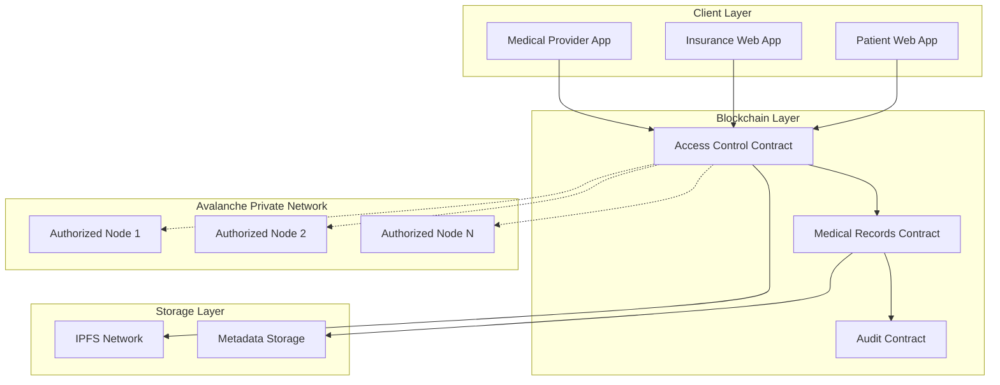

# Design Document

## Overview

The Decentralized Medical Records System is a blockchain-based platform that empowers patients with complete sovereignty over their medical data while enabling secure, permissioned access for insurance companies. Built on Avalanche's private network infrastructure, the system addresses critical challenges in medical record portability and patient data ownership in Bolivia and the broader LATAM region.

The system leverages client-side encryption, IPFS storage, and smart contract-based access control to create a secure, decentralized environment where patients maintain full control over their health data while enabling efficient insurance underwriting processes.

## Architecture

### High-Level Architecture



### Network Architecture

The system operates on a private Avalanche network with the following characteristics:

- **Permissioned Nodes**: Only contracted service providers can operate nodes
- **Private Subnet**: Isolated from public Avalanche network for enhanced security
- **Consensus Mechanism**: Avalanche consensus with authorized validators
- **Network Access**: Restricted to verified participants (patients, insurers, medical providers)

## Components and Interfaces

### 1. Smart Contract Layer

#### Access Control Contract (`AccessControl.sol`)

- **Purpose**: Manages permissions and access rights between patients and insurers
- **Key Functions**:
  - `grantAccess(address insurer, bytes32[] documentHashes, uint256 expirationTime)`
  - `revokeAccess(address insurer, bytes32[] documentHashes)`
  - `checkPermission(address patient, address insurer, bytes32 documentHash)`
  - `updatePermission(address insurer, bytes32 documentHash, uint256 newExpiration)`

#### Medical Records Contract (`MedicalRecords.sol`)

- **Purpose**: Stores document metadata and IPFS hashes
- **Key Functions**:
  - `addDocument(bytes32 ipfsHash, bytes32 encryptedMetadata, uint256 timestamp)`
  - `getDocument(bytes32 documentId)`
  - `updateDocumentMetadata(bytes32 documentId, bytes32 newMetadata)`
  - `markDocumentDeleted(bytes32 documentId)`

#### Audit Contract (`AuditTrail.sol`)

- **Purpose**: Maintains immutable audit logs for compliance
- **Key Functions**:
  - `logAccess(address accessor, bytes32 documentHash, uint256 timestamp)`
  - `logPermissionChange(address patient, address insurer, bytes32 documentHash, string action)`
  - `getAuditTrail(address patient, uint256 fromTime, uint256 toTime)`

### 2. Encryption Layer

#### Client-Side Encryption Service

- **Algorithm**: ECIES (Elliptic Curve Integrated Encryption Scheme)
- **Key Management**: Patient's private key for encryption, delegated decryption for authorized parties
- **Implementation**: Browser-based encryption using Web3 cryptographic libraries

```javascript
// Encryption Flow
class EncryptionService {
  async encryptDocument(document, patientPrivateKey) {
    // Generate symmetric key
    const symmetricKey = crypto.getRandomValues(new Uint8Array(32));

    // Encrypt document with AES
    const encryptedDocument = await this.aesEncrypt(document, symmetricKey);

    // Encrypt symmetric key with patient's public key
    const encryptedKey = await this.eciesEncrypt(
      symmetricKey,
      patientPrivateKey
    );

    return { encryptedDocument, encryptedKey };
  }

  async delegateAccess(encryptedKey, patientPrivateKey, insurerPublicKey) {
    // Decrypt symmetric key with patient's private key
    const symmetricKey = await this.eciesDecrypt(
      encryptedKey,
      patientPrivateKey
    );

    // Re-encrypt symmetric key with insurer's public key
    const delegatedKey = await this.eciesEncrypt(
      symmetricKey,
      insurerPublicKey
    );

    return delegatedKey;
  }
}
```

### 3. Frontend Applications (Scaffold-ETH 2)

#### Core Framework Architecture

- **Framework**: Scaffold-ETH 2 (Next.js + React + TypeScript)
- **Web3 Integration**: Wagmi hooks with automatic TypeScript contract bindings
- **Wallet Connection**: RainbowKit for seamless multi-wallet support
- **Development Tools**: Built-in contract debugging and block explorer

#### Landing Page (`pages/index.tsx`)

- **Framework**: Next.js with responsive design and SEO optimization
- **Key Features**:
  - System overview and benefits
  - Role-based navigation (Patient/Specialist/Insurance)
  - Getting started guides
  - Contact and support information
  - Wallet connection status indicator

#### Authentication & Role Management (`pages/auth.tsx`)

- **Framework**: Next.js with RainbowKit wallet integration
- **Key Features**:
  - Multi-wallet connection (MetaMask, WalletConnect, Coinbase, etc.)
  - Role-based authentication using smart contract verification
  - Account creation and recovery flows
  - Persistent wallet connection state

#### Patient Dashboard (`pages/patient/dashboard.tsx`)

- **Framework**: Next.js with custom Wagmi hooks
- **Key Features**:
  - Medical record upload and management
  - Permission management interface using `useScaffoldContractWrite`
  - Access history and audit logs via `useScaffoldContractRead`
  - Real-time wallet connection and network status
  - Contract interaction debugging tools

#### Medic Portal (`pages/medic/portal.tsx`)

- **Framework**: Next.js with medical workflow optimization
- **Key Features**:
  - Patient record access (with explicit permission verification)
  - Medical document viewing and analysis
  - Treatment history review using contract queries
  - Access request management with transaction monitoring
  - Professional verification interface

#### Insurance Portal (`pages/insurance/portal.tsx`)

- **Framework**: Next.js with role-based access controls
- **Key Features**:
  - Authorized document viewing for risk assessment
  - Policy underwriting tools with contract integration
  - Access request management using Scaffold hooks
  - Audit trail viewing with real-time updates
  - Claims processing support with transaction history

#### Custom Scaffold Components

```typescript
// Custom hooks for medical records contract interaction
export const useMedicalRecords = () => {
  const { data: documents } = useScaffoldContractRead({
    contractName: "MedicalRecords",
    functionName: "getPatientDocuments",
    args: [address],
  });

  const { writeAsync: addDocument } = useScaffoldContractWrite({
    contractName: "MedicalRecords",
    functionName: "addDocument",
  });

  return { documents, addDocument };
};

// Custom hook for access control management
export const useAccessControl = () => {
  const { writeAsync: grantAccess } = useScaffoldContractWrite({
    contractName: "AccessControl",
    functionName: "grantAccess",
  });

  const { data: permissions } = useScaffoldContractRead({
    contractName: "AccessControl",
    functionName: "getPermissions",
    args: [patientAddress],
  });

  return { grantAccess, permissions };
};
```

### 4. IPFS Integration

#### Document Storage Service

- **Storage**: Encrypted documents stored on IPFS
- **Metadata**: Document metadata stored on-chain
- **Retrieval**: Content-addressed retrieval using IPFS hashes
- **Redundancy**: Multiple IPFS nodes for high availability

## Data Models

### Patient Entity

```solidity
struct Patient {
    address walletAddress;
    bytes32 publicKeyHash;
    uint256 registrationTimestamp;
    bool isActive;
    mapping(bytes32 => DocumentMetadata) documents;
}
```

### Document Metadata

```solidity
struct DocumentMetadata {
    bytes32 ipfsHash;
    bytes32 encryptedMetadata;
    uint256 uploadTimestamp;
    address uploadedBy;
    bool isDeleted;
    DocumentType docType;
}
```

### Access Permission

```solidity
struct AccessPermission {
    address patient;
    address insurer;
    bytes32[] documentHashes;
    uint256 grantedTimestamp;
    uint256 expirationTimestamp;
    bool isActive;
}
```

### Audit Log Entry

```solidity
struct AuditEntry {
    address actor;
    address patient;
    bytes32 documentHash;
    string action;
    uint256 timestamp;
    bytes32 additionalData;
}
```

## Error Handling

### Smart Contract Error Handling

- **Custom Errors**: Implement specific error types for different failure scenarios
- **Access Control Errors**: `UnauthorizedAccess`, `ExpiredPermission`, `InvalidDocument`
- **Validation Errors**: `InvalidAddress`, `InvalidTimestamp`, `DocumentNotFound`
- **Network Errors**: `NodeNotAuthorized`, `NetworkUnavailable`

### Frontend Error Handling

- **Wallet Connection**: Handle MetaMask/wallet connection failures
- **Transaction Failures**: Provide clear feedback for failed blockchain transactions
- **Encryption Errors**: Handle cryptographic operation failures
- **Network Issues**: Implement retry mechanisms for IPFS and blockchain calls

### IPFS Error Handling

- **Upload Failures**: Implement retry logic with exponential backoff
- **Retrieval Failures**: Fallback to alternative IPFS gateways
- **Network Partitions**: Handle temporary IPFS network unavailability

## Testing Strategy

### Unit Testing

- **Smart Contracts**: Comprehensive Solidity test suites using Hardhat with Scaffold-ETH 2 testing framework
- **Encryption Services**: Test cryptographic operations with known test vectors
- **Frontend Components**: Next.js component testing with Jest, React Testing Library, and Scaffold testing utilities
- **Custom Hooks**: Test Wagmi-based custom hooks with mock contract interactions

### Integration Testing

- **End-to-End Workflows**: Test complete patient-to-insurer access flows
- **Cross-Contract Interactions**: Test interactions between smart contracts
- **IPFS Integration**: Test document upload, storage, and retrieval flows

### Security Testing

- **Cryptographic Audits**: Verify encryption/decryption implementations
- **Smart Contract Audits**: Security review of access control logic
- **Penetration Testing**: Test for unauthorized access attempts
- **Key Management Testing**: Verify secure key generation and storage

### Performance Testing

- **Blockchain Load Testing**: Test contract performance under high transaction volumes
- **IPFS Performance**: Test document upload/download speeds
- **Frontend Performance**: Test UI responsiveness with large datasets

### Compliance Testing

- **Audit Trail Verification**: Ensure all access events are properly logged
- **Permission Enforcement**: Verify access controls work as designed
- **Data Integrity**: Test document tamper detection mechanisms
- **Regulatory Compliance**: Verify system meets healthcare data protection requirements

## Security Considerations

### Cryptographic Security

- **Key Generation**: Use cryptographically secure random number generation
- **Key Storage**: Implement secure key storage mechanisms
- **Encryption Standards**: Use industry-standard encryption algorithms (AES-256, ECIES)
- **Key Rotation**: Implement periodic key rotation capabilities

### Access Control Security

- **Permission Granularity**: Implement fine-grained access controls
- **Time-based Access**: Enforce expiration times for access permissions
- **Revocation Mechanisms**: Ensure immediate access revocation capabilities
- **Multi-signature Requirements**: Consider multi-sig for critical operations

### Network Security

- **Node Authorization**: Strict verification of network participants
- **Communication Encryption**: TLS encryption for all network communications
- **DDoS Protection**: Implement rate limiting and DDoS mitigation
- **Monitoring**: Comprehensive logging and monitoring of network activities

## Deployment Architecture

### Development Environment

- **Local Blockchain**: Hardhat local network with Avalanche configuration
- **IPFS Node**: Local IPFS node for testing
- **Frontend**: Next.js development server with Scaffold-ETH 2 tooling
- **Contract Debugging**: Built-in Scaffold-ETH 2 debug interface
- **Block Explorer**: Integrated block explorer for transaction monitoring

### Staging Environment

- **Private Testnet**: Avalanche private testnet with limited nodes
- **IPFS Cluster**: Multi-node IPFS cluster for redundancy testing
- **Load Testing**: Simulated high-load scenarios

### Production Environment

- **Private Mainnet**: Fully configured Avalanche private network
- **IPFS Infrastructure**: Distributed IPFS nodes across multiple regions
- **Monitoring**: Comprehensive monitoring and alerting systems
- **Backup Systems**: Regular backups of critical system components
